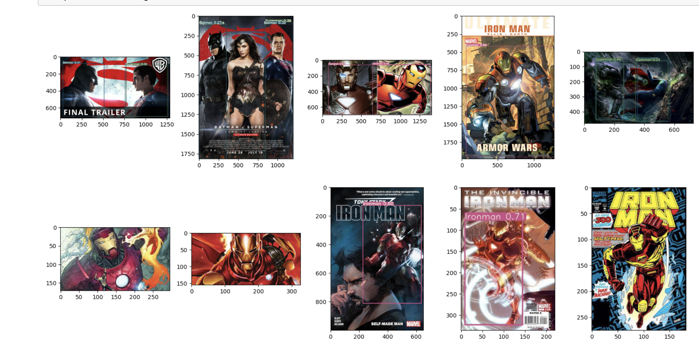

# Session 7 Assignment

This assignment is for training Yolov3 for custome dataset here we have picked a dataset of superman,batman and ironman
## Training Log
Image sizes 512 - 512 train, 512 test
Using 8 dataloader workers
Starting training for 50 epochs...

     Epoch   gpu_mem      GIoU       obj       cls     total   targets  img_size
      0/49        0G       5.7      64.7      2.32      72.7        12       512: 100%|█| 12/12 [02:56<00:00, 14.69s/
               Class    Images   Targets         P         R   mAP@0.5        F1: 100%|█| 12/12 [04:32<00:00, 22.67s/
                 all       115       139  0.000302      0.02  0.000399  0.000594

     Epoch   gpu_mem      GIoU       obj       cls     total   targets  img_size
      1/49        0G      5.16      4.59      2.28        12        17       512: 100%|█| 12/12 [02:57<00:00, 14.80s/
               Class    Images   Targets         P         R   mAP@0.5        F1: 100%|█| 12/12 [02:20<00:00, 11.71s/
                 all       115       139         0         0   0.00803         0

     Epoch   gpu_mem      GIoU       obj       cls     total   targets  img_size
      2/49        0G      4.22      2.87      2.19      9.28        10       512: 100%|█| 12/12 [02:59<00:00, 14.94s/
               Class    Images   Targets         P         R   mAP@0.5        F1: 100%|█| 12/12 [01:34<00:00,  7.87s/
                 all       115       139         0         0     0.108         0

     Epoch   gpu_mem      GIoU       obj       cls     total   targets  img_size
      3/49        0G      4.29      2.93      2.25      9.47        11       512: 100%|█| 12/12 [03:00<00:00, 15.02s/
               Class    Images   Targets         P         R   mAP@0.5        F1: 100%|█| 12/12 [01:21<00:00,  6.82s/
                 all       115       139     0.333   0.00758      0.19    0.0148

     Epoch   gpu_mem      GIoU       obj       cls     total   targets  img_size
      4/49        0G      4.34      3.47      2.17      9.99        13       512: 100%|█| 12/12 [02:57<00:00, 14.82s/
               Class    Images   Targets         P         R   mAP@0.5        F1: 100%|█| 12/12 [01:23<00:00,  6.94s/
                 all       115       139         0         0     0.222         0

     Epoch   gpu_mem      GIoU       obj       cls     total   targets  img_size
      5/49        0G      3.22      3.42      1.97      8.61        15       512: 100%|█| 12/12 [03:03<00:00, 15.28s/
               Class    Images   Targets         P         R   mAP@0.5        F1: 100%|█| 12/12 [01:34<00:00,  7.86s/
                 all       115       139     0.346    0.0491      0.22    0.0824

     Epoch   gpu_mem      GIoU       obj       cls     total   targets  img_size
      6/49        0G      3.11      2.81      1.95      7.87        11       512: 100%|█| 12/12 [02:58<00:00, 14.84s/
               Class    Images   Targets         P         R   mAP@0.5        F1: 100%|█| 12/12 [01:21<00:00,  6.81s/
                 all       115       139     0.181     0.595     0.241     0.277

     Epoch   gpu_mem      GIoU       obj       cls     total   targets  img_size
      7/49        0G      2.99      2.45       1.9      7.34        14       512: 100%|█| 12/12 [02:58<00:00, 14.89s/
               Class    Images   Targets         P         R   mAP@0.5        F1: 100%|█| 12/12 [01:23<00:00,  6.94s/
                 all       115       139     0.117     0.816     0.231     0.205

     Epoch   gpu_mem      GIoU       obj       cls     total   targets  img_size
      8/49        0G      3.17       2.2      1.84      7.22        14       512: 100%|█| 12/12 [03:01<00:00, 15.09s/
               Class    Images   Targets         P         R   mAP@0.5        F1: 100%|█| 12/12 [01:22<00:00,  6.86s/
                 all       115       139    0.0783     0.853     0.203     0.143

     Epoch   gpu_mem      GIoU       obj       cls     total   targets  img_size
      9/49        0G      2.74      1.85      1.79      6.39        10       512: 100%|█| 12/12 [02:57<00:00, 14.75s/
               Class    Images   Targets         P         R   mAP@0.5        F1: 100%|█| 12/12 [51:39<00:00, 258.25s
                 all       115       139     0.076     0.824     0.178     0.139

     Epoch   gpu_mem      GIoU       obj       cls     total   targets  img_size
     10/49        0G      3.19         2      1.94      7.13        14       512: 100%|█| 12/12 [03:16<00:00, 16.36s/
               Class    Images   Targets         P         R   mAP@0.5        F1: 100%|█| 12/12 [01:23<00:00,  6.96s/
                 all       115       139     0.117     0.774      0.18     0.204

     Epoch   gpu_mem      GIoU       obj       cls     total   targets  img_size
     11/49        0G      3.04      1.74      1.83      6.61        14       512: 100%|█| 12/12 [02:56<00:00, 14.70s/
               Class    Images   Targets         P         R   mAP@0.5        F1: 100%|█| 12/12 [01:24<00:00,  7.03s/
                 all       115       139     0.132       0.7     0.191     0.222

     Epoch   gpu_mem      GIoU       obj       cls     total   targets  img_size
     12/49        0G      2.77       1.6      1.76      6.13        11       512: 100%|█| 12/12 [02:55<00:00, 14.59s/
               Class    Images   Targets         P         R   mAP@0.5        F1: 100%|█| 12/12 [01:32<00:00,  7.70s/
                 all       115       139     0.162       0.7     0.212     0.264

     Epoch   gpu_mem      GIoU       obj       cls     total   targets  img_size
     13/49        0G      2.61      1.51      1.76      5.88        13       512: 100%|█| 12/12 [02:57<00:00, 14.80s/
               Class    Images   Targets         P         R   mAP@0.5        F1: 100%|█| 12/12 [01:22<00:00,  6.91s/
                 all       115       139     0.174      0.61     0.215     0.271

     Epoch   gpu_mem      GIoU       obj       cls     total   targets  img_size
     14/49        0G       3.4       1.3      1.97      6.67        13       512: 100%|█| 12/12 [02:57<00:00, 14.82s/
               Class    Images   Targets         P         R   mAP@0.5        F1: 100%|█| 12/12 [01:22<00:00,  6.89s/
                 all       115       139     0.169     0.618     0.231     0.265

     Epoch   gpu_mem      GIoU       obj       cls     total   targets  img_size
     15/49        0G      3.26      1.42      1.71      6.39        15       512: 100%|█| 12/12 [02:57<00:00, 14.76s/
               Class    Images   Targets         P         R   mAP@0.5        F1: 100%|█| 12/12 [01:22<00:00,  6.89s/
                 all       115       139      0.21     0.582      0.27     0.309

     Epoch   gpu_mem      GIoU       obj       cls     total   targets  img_size
     16/49        0G      3.12      1.46      1.89      6.48        16       512: 100%|█| 12/12 [02:59<00:00, 14.99s/
               Class    Images   Targets         P         R   mAP@0.5        F1: 100%|█| 12/12 [01:32<00:00,  7.72s/
                 all       115       139     0.234     0.613     0.307     0.339

     Epoch   gpu_mem      GIoU       obj       cls     total   targets  img_size
     17/49        0G      1.98      1.13      1.69       4.8        14       512: 100%|█| 12/12 [18:08<00:00, 90.72s/
               Class    Images   Targets         P         R   mAP@0.5        F1: 100%|█| 12/12 [01:35<00:00,  7.95s/
                 all       115       139     0.298     0.623     0.356     0.403

     Epoch   gpu_mem      GIoU       obj       cls     total   targets  img_size
     18/49        0G      2.67      1.44      1.75      5.87        11       512: 100%|█| 12/12 [02:57<00:00, 14.81s/
               Class    Images   Targets         P         R   mAP@0.5        F1: 100%|█| 12/12 [01:23<00:00,  6.92s/
                 all       115       139     0.328     0.729     0.396      0.45

     Epoch   gpu_mem      GIoU       obj       cls     total   targets  img_size
     19/49        0G         2      1.16      1.71      4.88         9       512: 100%|█| 12/12 [03:07<00:00, 15.66s/
               Class    Images   Targets         P         R   mAP@0.5        F1: 100%|█| 12/12 [01:33<00:00,  7.82s/
                 all       115       139     0.318     0.675     0.403      0.43

     Epoch   gpu_mem      GIoU       obj       cls     total   targets  img_size
     20/49        0G       2.7      1.19      1.76      5.66        13       512: 100%|█| 12/12 [02:58<00:00, 14.88s/
               Class    Images   Targets         P         R   mAP@0.5        F1: 100%|█| 12/12 [01:23<00:00,  6.92s/
                 all       115       139     0.329     0.553     0.395      0.41

     Epoch   gpu_mem      GIoU       obj       cls     total   targets  img_size
     21/49        0G      2.52       1.1      1.69      5.31        16       512: 100%|█| 12/12 [02:57<00:00, 14.81s/
               Class    Images   Targets         P         R   mAP@0.5        F1: 100%|█| 12/12 [01:25<00:00,  7.12s/
                 all       115       139       0.3     0.631     0.398     0.403

     Epoch   gpu_mem      GIoU       obj       cls     total   targets  img_size
     22/49        0G      2.54      1.08      1.71      5.32        11       512: 100%|█| 12/12 [03:06<00:00, 15.57s/
               Class    Images   Targets         P         R   mAP@0.5        F1: 100%|█| 12/12 [01:28<00:00,  7.41s/
                 all       115       139     0.335     0.664     0.427     0.444

     Epoch   gpu_mem      GIoU       obj       cls     total   targets  img_size
     23/49        0G       2.2      1.03      1.73      4.96        17       512: 100%|█| 12/12 [1:01:19<00:00, 306.6
               Class    Images   Targets         P         R   mAP@0.5        F1: 100%|█| 12/12 [01:24<00:00,  7.02s/
                 all       115       139     0.311     0.627     0.428     0.414

     Epoch   gpu_mem      GIoU       obj       cls     total   targets  img_size
     24/49        0G      2.16      1.04      1.67      4.86        12       512: 100%|█| 12/12 [03:13<00:00, 16.12s/
               Class    Images   Targets         P         R   mAP@0.5        F1: 100%|█| 12/12 [01:22<00:00,  6.88s/
                 all       115       139     0.358     0.651     0.445      0.46

     Epoch   gpu_mem      GIoU       obj       cls     total   targets  img_size
     25/49        0G      2.82      1.07      1.72       5.6        12       512: 100%|█| 12/12 [02:56<00:00, 14.67s/
               Class    Images   Targets         P         R   mAP@0.5        F1: 100%|█| 12/12 [01:21<00:00,  6.82s/
                 all       115       139     0.377     0.649     0.453     0.476

     Epoch   gpu_mem      GIoU       obj       cls     total   targets  img_size
     26/49        0G      2.29     0.869      1.82      4.98         9       512: 100%|█| 12/12 [02:54<00:00, 14.57s/
               Class    Images   Targets         P         R   mAP@0.5        F1: 100%|█| 12/12 [01:22<00:00,  6.85s/
                 all       115       139     0.379     0.652     0.464     0.479

     Epoch   gpu_mem      GIoU       obj       cls     total   targets  img_size
     27/49        0G      2.44     0.797      1.62      4.86        12       512: 100%|█| 12/12 [03:00<00:00, 15.04s/
               Class    Images   Targets         P         R   mAP@0.5        F1: 100%|█| 12/12 [01:22<00:00,  6.86s/
                 all       115       139       0.4     0.606     0.461     0.482

     Epoch   gpu_mem      GIoU       obj       cls     total   targets  img_size
     28/49        0G      2.17      1.03      1.65      4.85        15       512: 100%|█| 12/12 [02:57<00:00, 14.80s/
               Class    Images   Targets         P         R   mAP@0.5        F1: 100%|█| 12/12 [01:25<00:00,  7.15s/
                 all       115       139     0.399      0.63     0.492     0.487

     Epoch   gpu_mem      GIoU       obj       cls     total   targets  img_size
     29/49        0G       1.6     0.976      1.59      4.17        13       512: 100%|█| 12/12 [03:00<00:00, 15.03s/
               Class    Images   Targets         P         R   mAP@0.5        F1: 100%|█| 12/12 [01:23<00:00,  6.93s/
                 all       115       139     0.381     0.748     0.514     0.504

     Epoch   gpu_mem      GIoU       obj       cls     total   targets  img_size
     30/49        0G      1.86     0.891      1.61      4.36        12       512: 100%|█| 12/12 [02:57<00:00, 14.77s/
               Class    Images   Targets         P         R   mAP@0.5        F1: 100%|█| 12/12 [01:22<00:00,  6.84s/
                 all       115       139     0.381     0.721     0.503     0.498

     Epoch   gpu_mem      GIoU       obj       cls     total   targets  img_size
     31/49        0G      1.58     0.952      1.49      4.02        12       512: 100%|█| 12/12 [02:58<00:00, 14.92s/
               Class    Images   Targets         P         R   mAP@0.5        F1: 100%|█| 12/12 [01:33<00:00,  7.80s/
                 all       115       139     0.418     0.722     0.532     0.528

     Epoch   gpu_mem      GIoU       obj       cls     total   targets  img_size
     32/49        0G      1.61     0.873      1.55      4.03        10       512: 100%|█| 12/12 [03:01<00:00, 15.10s/
               Class    Images   Targets         P         R   mAP@0.5        F1: 100%|█| 12/12 [05:00<00:00, 25.03s/
                 all       115       139     0.413     0.734     0.547     0.527

     Epoch   gpu_mem      GIoU       obj       cls     total   targets  img_size
     33/49        0G      1.68     0.962      1.48      4.12        15       512: 100%|█| 12/12 [02:55<00:00, 14.64s/
               Class    Images   Targets         P         R   mAP@0.5        F1: 100%|█| 12/12 [01:23<00:00,  6.92s/
                 all       115       139     0.397     0.755     0.548     0.518

     Epoch   gpu_mem      GIoU       obj       cls     total   targets  img_size
     34/49        0G      1.93     0.889       1.5      4.32        16       512: 100%|█| 12/12 [02:56<00:00, 14.74s/
               Class    Images   Targets         P         R   mAP@0.5        F1: 100%|█| 12/12 [01:22<00:00,  6.85s/
                 all       115       139     0.401     0.832      0.58     0.539

     Epoch   gpu_mem      GIoU       obj       cls     total   targets  img_size
     35/49        0G      1.88     0.866      1.76      4.51        17       512: 100%|█| 12/12 [02:58<00:00, 14.87s/
               Class    Images   Targets         P         R   mAP@0.5        F1: 100%|█| 12/12 [01:23<00:00,  6.93s/
                 all       115       139     0.397     0.835     0.576     0.536

     Epoch   gpu_mem      GIoU       obj       cls     total   targets  img_size
     36/49        0G      1.57     0.867       1.4      3.83        13       512: 100%|█| 12/12 [02:57<00:00, 14.80s/
               Class    Images   Targets         P         R   mAP@0.5        F1: 100%|█| 12/12 [01:23<00:00,  6.96s/
                 all       115       139     0.403     0.846     0.588     0.544

     Epoch   gpu_mem      GIoU       obj       cls     total   targets  img_size
     37/49        0G      2.19     0.825      1.41      4.43         9       512: 100%|█| 12/12 [03:00<00:00, 15.07s/
               Class    Images   Targets         P         R   mAP@0.5        F1: 100%|█| 12/12 [01:23<00:00,  6.93s/
                 all       115       139     0.421     0.884     0.596     0.569

     Epoch   gpu_mem      GIoU       obj       cls     total   targets  img_size
     38/49        0G      1.86     0.771      1.39      4.02        21       512: 100%|█| 12/12 [02:58<00:00, 14.84s/
               Class    Images   Targets         P         R   mAP@0.5        F1: 100%|█| 12/12 [01:22<00:00,  6.88s/
                 all       115       139      0.43     0.871     0.609     0.574

     Epoch   gpu_mem      GIoU       obj       cls     total   targets  img_size
     39/49        0G      2.07     0.863      1.35      4.29        10       512: 100%|█| 12/12 [02:19<00:00,  9.95s/     39/49        0G      2.07     0.863      1.35      4.29        10       512: 100%|█| 12/12 [02:59<00:00, 14.93s/
               Class    Images   Targets         P         R   mAP@0.5        F1: 100%|█| 12/12 [01:22<00:00,  6.85s/
                 all       115       139     0.428      0.89      0.62     0.578

     Epoch   gpu_mem      GIoU       obj       cls     total   targets  img_size
     40/49        0G      1.59     0.792      1.41      3.79         7       512: 100%|█| 12/12 [02:58<00:00, 14.91s/
               Class    Images   Targets         P         R   mAP@0.5        F1: 100%|█| 12/12 [01:32<00:00,  7.71s/
                 all       115       139     0.412     0.904     0.634     0.566

     Epoch   gpu_mem      GIoU       obj       cls     total   targets  img_size
     41/49        0G      2.26     0.766      1.44      4.46        21       512:  67%|▋| 8/12 [01:36<00:46, 11.72s/i
Model Bias Summary:    layer        regression        objectness    classification
                          89      -0.07+/-0.24      -8.86+/-2.78      -0.37+/-0.11 
                         101       0.16+/-0.23      -9.61+/-1.35      -0.30+/-0.22 
                         113       0.04+/-0.15      -8.79+/-0.93      -0.20+/-0.54 
     41/49        0G      1.91      0.85      1.43      4.19        19       512: 100%|█| 12/12 [02:58<00:00, 14.88s/
               Class    Images   Targets         P         R   mAP@0.5        F1: 100%|█| 12/12 [01:23<00:00,  6.92s/
                 all       115       139     0.426     0.919     0.641     0.582

     Epoch   gpu_mem      GIoU       obj       cls     total   targets  img_size
     42/49        0G      1.45     0.697      1.35       3.5        13       512: 100%|█| 12/12 [02:57<00:00, 14.77s/
               Class    Images   Targets         P         R   mAP@0.5        F1: 100%|█| 12/12 [01:22<00:00,  6.84s/
                 all       115       139      0.43     0.919      0.65     0.586

     Epoch   gpu_mem      GIoU       obj       cls     total   targets  img_size
     43/49        0G      1.35     0.843      1.28      3.47         8       512: 100%|█| 12/12 [02:56<00:00, 14.73s/
               Class    Images   Targets         P         R   mAP@0.5        F1: 100%|█| 12/12 [01:40<00:00,  8.35s/
                 all       115       139     0.439     0.933      0.65     0.597

     Epoch   gpu_mem      GIoU       obj       cls     total   targets  img_size
     44/49        0G      1.37     0.747      1.28       3.4        13       512: 100%|█| 12/12 [02:59<00:00, 14.98s/
               Class    Images   Targets         P         R   mAP@0.5        F1: 100%|█| 12/12 [01:24<00:00,  7.06s/
                 all       115       139     0.445      0.94      0.65     0.604

     Epoch   gpu_mem      GIoU       obj       cls     total   targets  img_size
     45/49        0G      1.42      0.72       1.2      3.35        13       512: 100%|█| 12/12 [02:58<00:00, 14.87s/
               Class    Images   Targets         P         R   mAP@0.5        F1: 100%|█| 12/12 [01:22<00:00,  6.89s/
                 all       115       139     0.441      0.94     0.649       0.6

     Epoch   gpu_mem      GIoU       obj       cls     total   targets  img_size
     46/49        0G      1.54     0.689      1.21      3.44        11       512: 100%|█| 12/12 [02:55<00:00, 14.60s/
               Class    Images   Targets         P         R   mAP@0.5        F1: 100%|█| 12/12 [01:22<00:00,  6.89s/
                 all       115       139     0.437     0.948     0.654     0.599

     Epoch   gpu_mem      GIoU       obj       cls     total   targets  img_size
     47/49        0G      1.49     0.712       1.2       3.4         9       512: 100%|█| 12/12 [02:59<00:00, 14.94s/
               Class    Images   Targets         P         R   mAP@0.5        F1: 100%|█| 12/12 [01:23<00:00,  6.97s/
                 all       115       139     0.441      0.95     0.662     0.602

     Epoch   gpu_mem      GIoU       obj       cls     total   targets  img_size
     48/49        0G      1.49     0.742      1.29      3.52        12       512: 100%|█| 12/12 [02:59<00:00, 14.98s/
               Class    Images   Targets         P         R   mAP@0.5        F1: 100%|█| 12/12 [01:24<00:00,  7.00s/
                 all       115       139     0.443     0.955     0.665     0.605

     Epoch   gpu_mem      GIoU       obj       cls     total   targets  img_size
     49/49        0G      1.32     0.697      1.18       3.2        18       512: 100%|█| 12/12 [03:02<00:00, 15.23s/
               Class    Images   Targets         P         R   mAP@0.5        F1: 100%|█| 12/12 [01:23<00:00,  6.96s/
                 all       115       139     0.441     0.955     0.667     0.604
50 epochs completed in 6.074 hours.

## Test Output

**Yeswanth**
