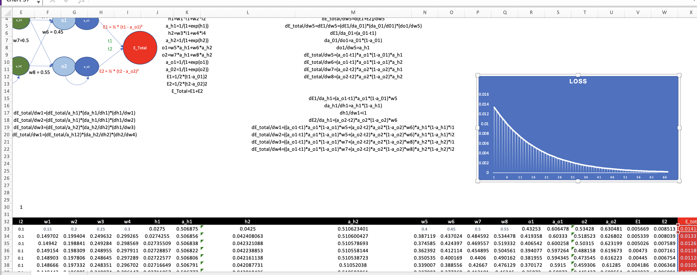

# Session 6 Assignment

This Assignement has two parts
1. Backpropagation using Excel
2. Improve the accuracy of MNIST dataset to 99.4%

##  Backpropgation

 

## Improve Accuracy

The second part of assignment is to increase the test accuracy of mnist dataset above 99.4% with less than 20k params which is attached in s6.ipynb

*Yeswanth
