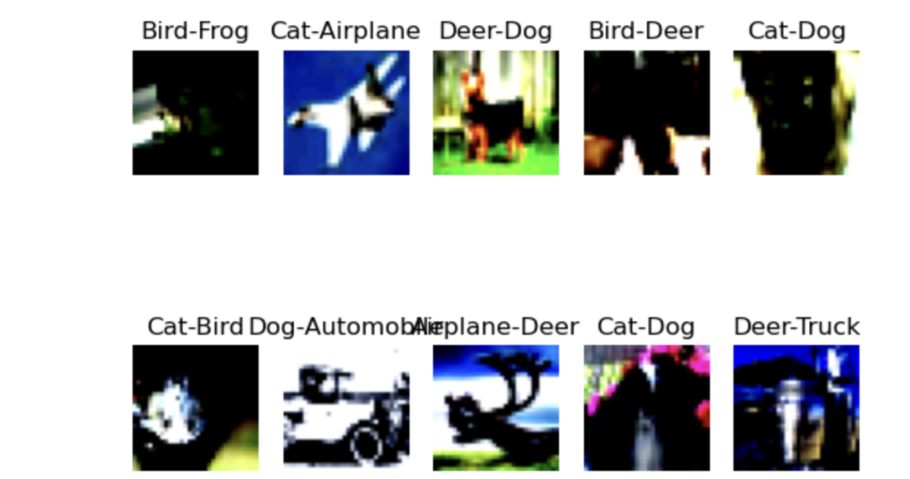
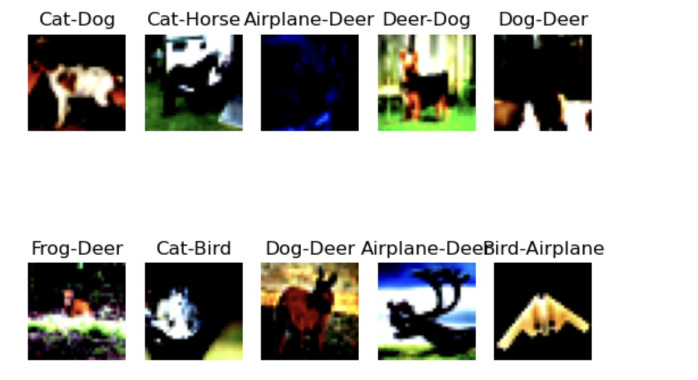
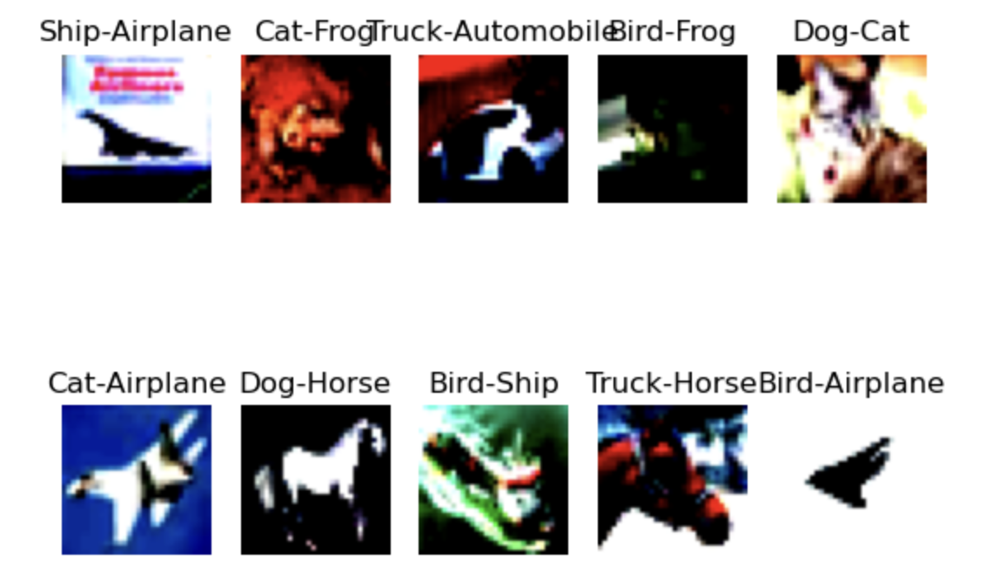

# Session 8 Assignment

This assignment is for classification of cisfar10 dataset by using three normalization techniques
1. Batch Normalization
2. Layer Normalization
3. Group Normalization

## Batch Normalization
In this code we have used Batch normalization
#### Result
1. parameters - 48,424
2. Best Training accuracy - 79.21
3. Best Test accuracy - 77.81

### Misclassified images

## Group Normalization

In this code we have used Batch normalization
#### Result
1. parameters - 48,424
2. Best Training accuracy - 75%
3. Best Test accuracy - 72%

### Misclassified images

## Layer Normalization

In this code we have used Batch normalization
#### Result
1. parameters - 51,877
2. Best Training accuracy - 56
3. Best Test accuracy - 56

### Misclassified images

## Author

**Yeswanth**
